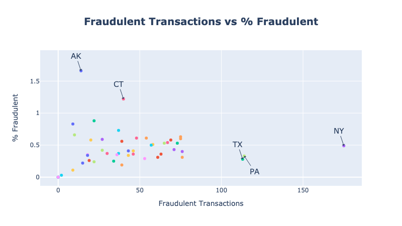
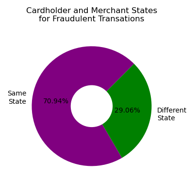

# Project-1

## Location Analysis

### Fraudulent transaction cardholder State

- The first step was to identify the number of fraudulent transactions by state.
- To achieve this, the database was filtered to only have the fraudulent transactions (2145).
- Then, the transactions were grouped by the cardholder state.
- A choropleth map was created to show how the fraud transactions were distributed among the different states.

**Analysis**: The map shows that the State with the highest number of fraudulent transactions is New York (175), followed by Pennsylvania (114) and Texas (113).

- A chi-squared analysis was performed to confirm if the fraudulent transactions were not equally distributed among the states.

**Analysis**: The p-value confirmed that the number of fraudulent transactions were higher in specific states and not distributed equally.

- A second step in this analysis was to explore the proportion of fraudulent transactions relative to the total number of transactions per State.
- A new Data Frame was created to sum the total number the transactions per state.
- This was later merged with the Data Frame containing the fraudulent transactions per State.
- A percentage column was included, and a second Choropleth map was created.

**Analysis**: This map shows a different view of the problem. In absolute terms, Alaska and Connecticut may not have many fraudulent transactions, but they represent more than 1% of their total number of transactions.

- Finally, a scatter plot was created, allowing us to see a combination of both maps' findings.

The values of the bottom right show the States with higher number of fraudulent transactions (New York, Pennsylvania, and Texas) the Upper Left show us the States with a high percentage of fraudulent transaction relative to its total amount of transactions.

**Conclusion**: The analysis of the Cardholder State can provide valuable input for the prediction of potential fraudulent transactions. The focus cannot be only on the States with high number of fraudulent transactions, but also on those with a higher percentage relative to the total amount of transactions.

### Fraudulent transaction merchant State

- In this case also, only the fraud transactions were used for the analysis.
- As the dataset only included merchant's latitude and longitude, the api Geoapify was used to obtain the State.
- 53 rows were removed from the analysis, as the latitude and longitude were in the middle of the ocean, therefore, no State was identified by the api.
- Then the name of the merchant States was replaced by the codes, to make them comparable with the cardholder State on the original data.

- The cardholder State was compared with the merchant State. When it was the same it was marked as true, and when different was marked as false.
- The results were then counted, and a donut chart was prepared.

**Analysis**: The chart shows that around 71% of the fraudulent transactions are performed with merchants located in the same State where the cardholder is located.

- To take the analysis a bit further, the merchant State was identified for the top 3 cardholder States (New York, Pennsylvania, and Texas)

**Analysis**: The bar chart confirms how most of the merchants where the fraudulent transactions happened, were located either in these three States or in States next to them, such as Connecticut, West Virginia, New Jersey, Oklahoma, Ontario, and Ohio.

**Conclusion**: The findings can help in the prediction of fraudulent transactions on how they are more likely to happen within the cardholder's state or the nearby States.